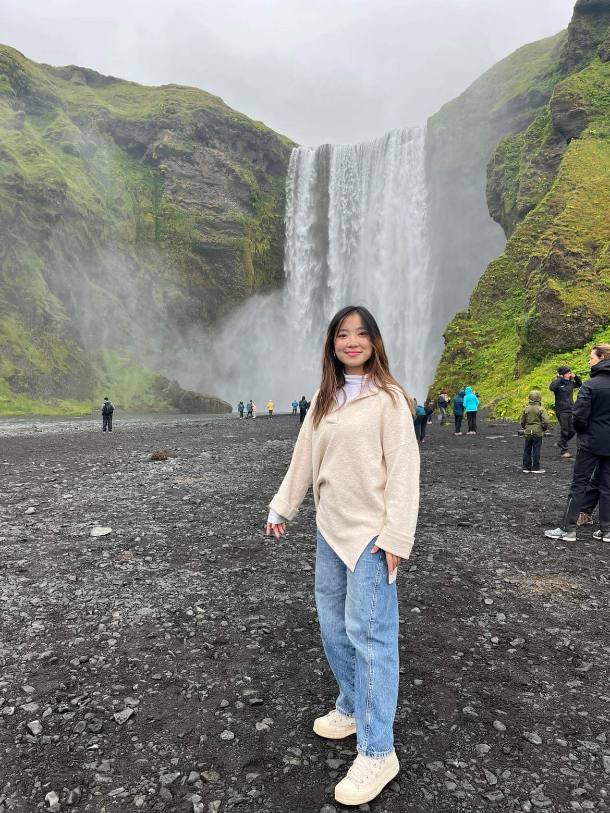

# Megan Cheung
{:width="200px"}
## Links
megcheu@uw.edu 

http://www.linkedin.com/in/megcheung

# Work Experience (last 10 years)

## Varsity Debate Coach (Bothell, WA)

*Verve Speech and Debate Club* | (September 2021 - Present)

Summary of Role:

- **Led the debate team** to victory in the regional championships, securing the first-place position.
- **Strategized** argument **research** and brief narratives. 
- **Implemented** and **created** new techniques and drills to improve student peformance.
- **Mentored** and **trained** research and argumentation skills.

## Legal Administrative Assistant (Kirkland, WA)
*Law Office of Jenny Cochrane* | (June 2022 - Nov 2022)

Summary of Role:

- **Communicated** professionally with courts, attorneys, and clients verbally and in writing in accordance the needs of the head attorney.
- Worked closely with the head attorney to **organize** deadlines, appointments, and filing system. 
- **Adapted quickly** to problems by **creatively thinking** of solutions that met the needs of attorneys and clients. 
- **Conducted research** on various case topics and legal precedents to support the attorney and fellow employees. 
- Spoke directly to clients to **identify their needs** and provided proper service to. 

## Dance Instructor (Bothell, WA)
*Cedar Park Dance Academy* | (Sep 2019 - Jul 2021)

Summary of Role:

- **Organized** class schedules
- **Taught** and **created** ballet excercises
- **Choreographed** dances for biannual peformances

# Extracurriculars
## Debate
- Ranked 8th at nationals and 16th nationally senior year of high school in Team Policy Debate.
- Learned to research public policy at an academic level, communication, and public speaking skills.
Constructed and deployed strategy from beginning to end that encompassed the overall and detailed attributes of a case. 

[SpeechRanks] (http://www.speechranks.com/2020/profile/view/7563)

